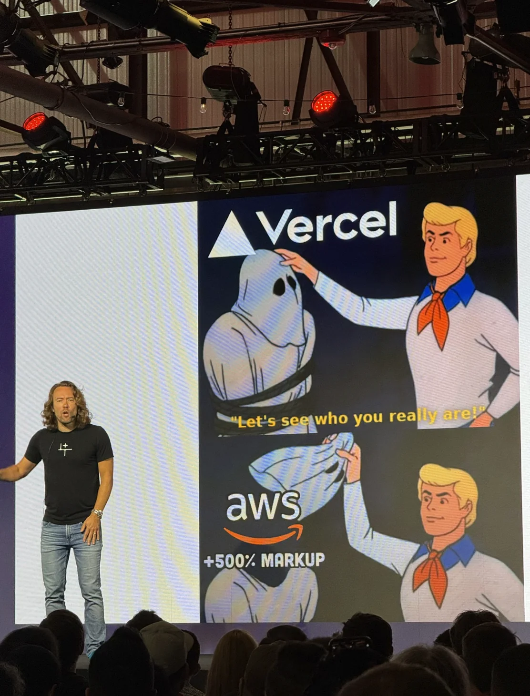

Disclaimer: This is not a comparison between web and mobile development, i also do not believe one is better than the other. This is simply my experience trying web development in 2024 after years of working on Android.

## The Beginning

For context, I’ve been an Android developer for five years. In 2024, I decided to expand my front-end skills by diving into web development.

The last time I touched web development was when I was a kid, back in the days of Flash. At that time, HTML, CSS, and JavaScript were complete mysteries to me.

## Trying Web Development

Where to begin? I should have started with the basics: learning HTML, CSS, and JavaScript. But, I jumped straight into the deep end.

Everywhere I looked, I saw mentions of React, Next.js and Tailwind CSS, so I decided to give them a try. Around this time, the Next.js app directory had just been announced. Without much thought, I ran `npx create-next-app@` and began building my first app.

To be honest, I was completely lost. I didn’t know what was happening or how to do anything. This experience made me realize the importance of learning the basics first.

## Key Takeaways

### JavaScript and TypeScript

Transitioning from Kotlin to JavaScript was quite an adjustment. At first, I was excited about the lack of type definitions, it felt refreshing and let me move so much faster without the constraints of types. It was as if I was telling my code, “Trust me, this will work.”

But as soon as I had to debug complex nested objects, I started missing types. Switching to TypeScript was a game-changer. The type inference is incredibly powerful in modern frameworks. For example, defining a server function automatically infers types on the client side.

I do miss classes, though. Having standalone functions scattered in a file felt strange at first, but I’m getting used to it.

### Frameworks

I experimented with several frameworks, including Next.js, Astro, Remix, SvelteKit, and SolidJS. All of them are fantastic. If I had to choose one, it would be SvelteKit, we vibe like that.

For instance, when I created a simple "Hello World" app, Next.js downloaded 500KB to the browser, on the other hand SvelteKit only 50KB. While this difference wasn’t noticeable in terms of speed for a simple portfolio, the 10x improvement in performance was hard to ignore.

### Deployment Process

I remember that i used a FTP client to upload my websites to my VPS. Now there are platforms like Vercel, Cloudflare, and Netlify that allow you to host your app for free.

The process is mind-blowingly simple: link your GitHub project, and your app is live in seconds. Crazy, right?

With platforms like Vercel (which I used the most), pushing automatically deploys your app. Just refresh the page, and it’s live. No need to create bundles, upload to the Play Store, wait for approval, and then publish. It’s like magic. This enables fast iteration and deployment.

Even though we should not be scared of servers(as [DHH](https://youtu.be/-cEn_83zRFw?si=CpXTNySQ7o6Mv79T&t=1966) said in his talk), i can't deny that these platforms let you get an MVP running in minutes!

Just be careful about leaving the free tier, costs can escalate quickly. Somewhat related, savage meme from the talk.

### Server-Side Code

The concept of server-side code that never touches the client is still mind-blowing to me. Coming from Android front-end development, where if we want server-side code we need to host it somewhere, and we have to deal with security and maintenance.

In Android, API keys are often hardcoded into the app, posing security risks. While there are tricks to obscure these keys, they’re not foolproof. In contrast, web frameworks include server-side capabilities by default, keeping sensitive data secure.

I remember the first time I needed a database. I tried Turso, and in just a few clicks I had everything up and running on a serverless function. With Drizzle, I could even edit the tables directly from my browser. It felt like magic!

This felt like a great start to backend development, something i want to also explore a bit more in the future.

### UI

This was a funny realization. While learning React, I noticed it reminded me a lot of Jetpack Compose, which I had explored before. The way React combines UI and logic in the same file just clicked with me.

That said, I did miss XML for more complex layouts. Navigating a huge file to figure out which button triggers which function can get messy. Breaking the UI into smaller, reusable components made a huge difference for me.

Also, there are so many UI libraries out there, it’s hard to keep up! Off the top of my head, I’d recommend Mantine, shadcn, MeltUI, Skeleton, and DaisyUI.

#### Tailwind CSS

It was pretty intimidating at first since I had zero CSS knowledge (my bad), but after a few months, I got to say it totally rocks! I liked it so much that I ended up porting the colors, font sizes, and spacing to an [Android library](https://github.com/puntogris/tailwind-styles-android).

Also, shoutout to [Flexbox froggy](https://flexboxfroggy.com/). It’s a fun game to learn flexbox.

### Tooling, Community and Resources

No emulator or Gradle configuration, just npm run dev and open your favorite browser. Most modern frameworks come with a development server that reloads the app on save. The simplicity and ease of setup were refreshing.

One thing that stood out to me is the difference in how communities are structured

- Android: The community feels more unified and connected to the platform. Google’s the big player here, providing most of the core resources, libraries, and tools like Jetpack, Compose. Since Google pushes these tools and has clear opinions on how things should be done, it’s easier for newcomers to just follow their guidelines and best practices when getting started.

- Web: The community feels a lot more fragmented. Depending on what tools or frameworks you pick, like React, Svelte, Tailwind, or Vite, you end up in smaller, niche communities. Each one has its own way of doing things, its own resources, and even its own lingo. This variety is super cool because you have so many options, but it can also be a bit overwhelming when you’re just starting out and trying to figure out where to begin.

### Monetization

On Android, monetization usually means in-app purchases, ads, and subscriptions, all managed through Google Play, which takes a cut of 15% to 30%. On the web, there’s no single marketplace, so you’re free to choose whatever works best for you.

For example, I was able to set up payments using crypto and local payment platforms in Argentina.

But I’ve got to admit, after trying out platforms like Stripe where you have to handle compliance and taxes yourself, the 15% cut Google Play takes doesn’t feel as bad anymore, especially since they handle everything for you.

## Final Thoughts

Web development has been a breath of fresh air. I’m glad I gave it a try, and I’m excited about what I can build in the future.

If you’re considering expanding your skill set, I highly recommend exploring web development. For me, i now feel like have the tools to build anything i want to build. I even gain some back-end knowledge!
