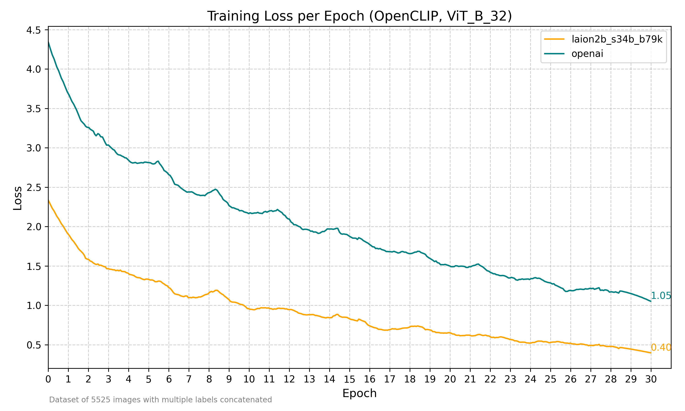
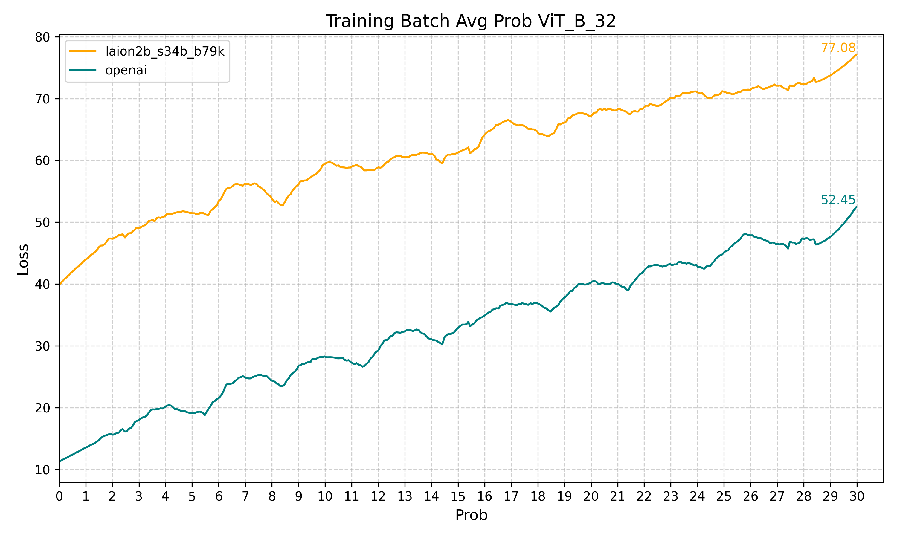

Let's explore how to fine-tune OpenCLIP using as base the `ViT-B-32` model and weights of `openai` and `laion2b_s34b_b79k`.

### What is OpenCLIP?

[OpenCLIP](https://github.com/mlfoundations/open_clip) is an open-source implementation of OpenAI's CLIP (Contrastive Language-Image Pre-training), it generates embeddings for images and natural language text. These embeddings enable tasks like classification and zero-shot image recognition.

### What will be need?

- Pytorch
- OpenCLIP python library
- Dataset of images with labels
- Patience and coffee – it's a long process!

### Some basics

This are a few concepts that you need to know to fine-tune OpenCLIP. I recommend to investigate a bit about them as it will help you understand the code better and make adjustments.

| Concept       | Description                                                                                                                                                                                                            |
| ------------- | ---------------------------------------------------------------------------------------------------------------------------------------------------------------------------------------------------------------------- |
| Epochs        | The number of iterations over the entire dataset                                                                                                                                                                       |
| Device        | This is the device where the model will be trained, it can be cpu or gpu. For NVIDIA GPUs you can use `cuda` and for Apple Sillicon GPUs `mps`.                                                                        |
| Batch size    | This is the number of images and text that will be processed at the same time. Keep in mind that the larger the batch size, the more memory you will need. For reference the batch size i use is 128 in a 1060 Ti GPU. |
| Learning rate | The rate at which the model learns. A lower learning rate means the model will learn more slowly, but it will converge faster.                                                                                         |
| Weight decay  | A regularization term that helps prevent overfitting. It adds a penalty to the loss function that is proportional to the square of the model's weights.                                                                |

### Ready, set, go!

You’ll find tons of examples online for fine-tuning models with PyTorch, also i'm sure your favorite LLM agent will give you a good starting point.
I will share some of the code i used, you can find the entire script in [train.py](https://github.com/puntogris/clipper/scripts/train.py).

#### Base model and pretrained weights

Here we have a lot of options, in this case we will explore the model `ViT-B-32` and weights of `openai` and `laion2b_s34b_b79k`.
OpenCLIP will dowload the model and weights for you.

```python
model, _, _ = open_clip.create_model_and_transforms("ViT-B-32", "openai")
optimizer = torch.optim.Adam(filter(lambda p: p.requires_grad, model.parameters()), 5e-6)
```

#### Data

We can use a dataloader to feed data into the model for training and manage batching and shuffling.
For this, let's create a custom dataset class to make it super flexible for reading data in various formats and files.

In my case, I had a CSV file containing image keys and labels, along with an LMDB file for the images.  
I was experimenting with a 400k images dataset, so i needed to put them in a single file or it would freeze my computer.

In the `init` method we will open both files, then on `get_item` we will read the image from the LMDB file and return it along with the tags.

```python
class CustomImageTextDataset(Dataset):
    def __init__(self, csv_path, lmdb_path, transform):
        self.data = pd.read_csv(csv_path, sep='|', names=['path', 'tags'], header=0)
        self.lmdb = lmdb.open(lmdb_path, readonly=True, lock=False)
        self.transform = transform

    def __len__(self):
        return len(self.data)

    def __getitem__(self, idx):
        row = self.data.iloc[idx]
        tags = row['tags']
        image_key = row['path']

        with self.lmdb.begin() as txn:
            image_data = txn.get(image_key.encode('utf-8'))

        image = Image.open(io.BytesIO(image_data)).convert('RGB')
        image = self.transform(image)

    return image, tags

# this model uses 224x224 images so we convert them in the transformer
dataset = CustomImageTextDataset(csv_path="data.csv", lmdb_path="images.lmdb", transform=transformer)
dataloader = DataLoader(dataset, batch_size=128, shuffle=True)
```

#### Training

We are pretty much ready to train the model, this will iterate over the epochs and the dataset.

Don't forget to add some prints to see what is happening. It's kinda fun to see the loss and the accuracy changes over time.

```python
for epoch in range(num_epochs):
    model.train()
    batches = len(dataloader)

    for images, tags in dataloader:
        images = images.to(device)

        text_inputs = open_clip.tokenize(list(tags)).to(device)
        image_features = model.encode_image(images)
        text_features = model.encode_text(text_inputs)
        logits_per_image = image_features @ text_features.t()

        targets = torch.arange(len(images)).to(device)
        loss = loss_fn(logits_per_image, targets)
        loss_item = loss.item()

        optimizer.zero_grad()
        loss.backward()
        optimizer.step()

    torch.save(model.state_dict(), "fine_tunned_model.pth")
```

Now is where the coffee comes in, run the script and we wait. In my case with a 1060 Ti of 6GB RAM it took about 10 hours to train.

If you are gonna traing for a long time, i would recommend saving the model every epoch just in case. If something goes wrong you can always load the saved model and continue training.

### Results

I trained the model for 30 epochs with a batch size of 128 and a learning rate of 0.0001.
There were a total of 5000 images, each with multiple labels.

The data of evaluation was the same as training so it's biased. In real-life use cases, I noticed the model achieved great accuracy, but the confidence was lower than the original model. This could be due to the small dataset or noice added with multiple labels perimage, but I'm not entirely sure. All in all, for my use case, the results were great.





### Final thoughts

It seems that `laion2b_s34b_b79k` outperforms `openai`, at least with the basic configuration used here.

Also it would be interesting to see how the model performs with a larger dataset, like 400k images, using a single label per image and playing with configurations like learning rate and decay.

This is a super cool topic to explore, i would encourage you to try it out and see for yourself. There are many more things to explore, like using a different model, different data, and different training configurations.
