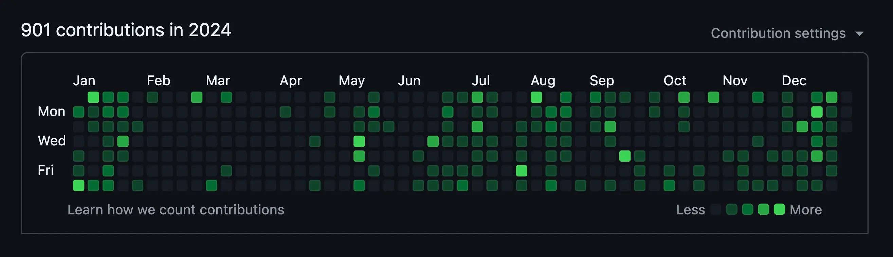
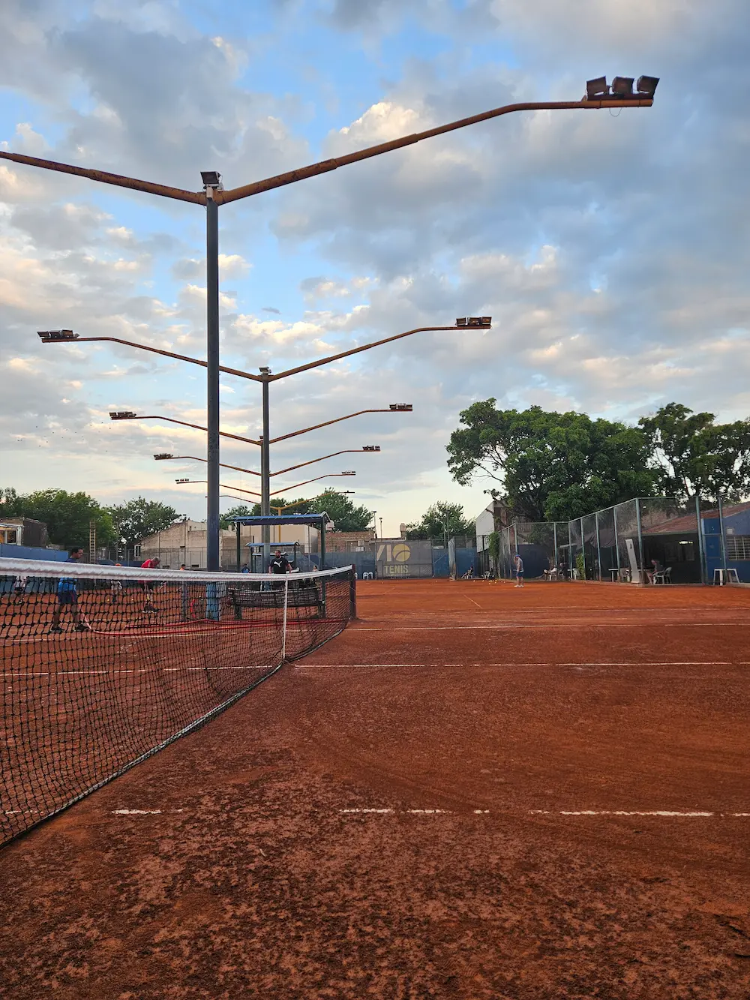
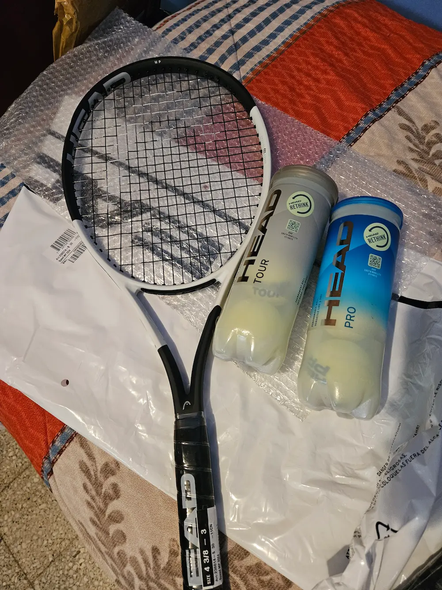
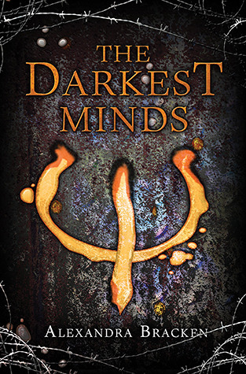
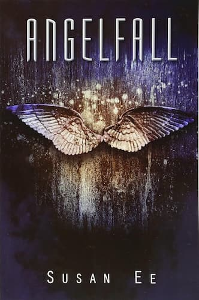
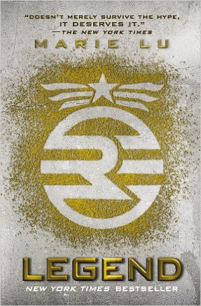
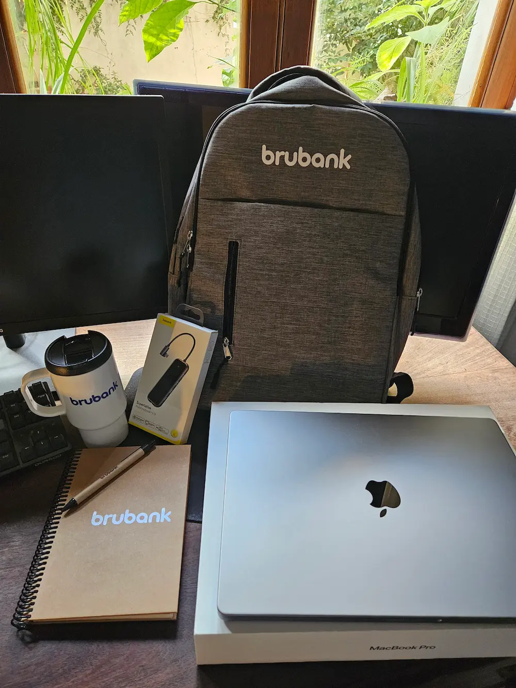

Well, this year was a good one, some things didn't go as planned but overall I'm happy with the results.

## Github: 2,46849315 average contributions per day

All in all, a great year. Burned myself out a few times, but that’s just because when I start a project I get super excited and have a hard time pacing myself.
Made some open-source contributions, it felt awesome to be part of projects I use every day. Definitely something I want to keep doing!

## Software

### Posture Reminder

The app is still growing, now at 15k installs. I’ve had some buyers reach out, but I decided not to sell as it didn't felt right. I’m currently working on version 3, which will expand features and introduce a revenue model.

### Diving into web development

At the start of 2024, I set a goal to improve my front-end skills. In some Android projects, I realized it would be great to have a web version or landing page, but I didn’t have the knowledge to build them.

So, I dove into web development, and wow! I absolutely fell in love with it. It was such a refreshing change, and it even made me appreciate Android development more. There’s still so much to learn, but I already find myself looking for any excuse to create a web version for every project.

Honorable mention to SvelteKit, which has quickly become my go-to framework, I can’t recommend it enough!

### Some AI

Towards the end of the year, I explored AI and developed an [Android Studio plugin](https://github.com/puntogris/telescope) that lets you use natural language to search for drawables in your app. Pretty cool, if I say so myself!

## Tennis

Started playing tennis again, it feels great to be back on the court after so long. Definitely going to need a teacher for a few months to get the hang of it again.

Picked up a new tennis racket, the Head Speed MP 2024. I don’t know much about rackets, but I like how it feels and have been getting some great slices with it.

## Books

I made some progress with my reading goal this year. I got the Kindle, downloaded a bunch of books, and actually managed to read a few!

I started with `Angelfall by Susan Ee`, which I really enjoyed. It’s a post-apocalyptic world where angels descend to Earth and start to rule over it. 9/10

Next up was `Legend by Marie Lu`. It was an easy read and I really liked the fast pace, though I got hooked around the middle of the book. 7/10

I’m currently reading `The Darkest Minds by Alexandra Bracken`. It’s taking me a little while to get into it and figure out what it’s about, but I’m enjoying it so far. ?/10

If you couldn’t figure it out, I’m into post-apocalyptic and dystopian fiction, so I guess it’s safe to say I’m a fan of stories set in worlds where everything's gone a little (or a lot) wrong.

### Mini review: Kindle Paperwhite

It was my first e-reader, and I loved it. Lightweight, easy to use, and the battery lasts forever.
I got the 8GB version, which is plenty to store a few hundred books.

One thing that sucks is Amazon shows ads as a screensaver. You can pay extra to remove them, but it’s not worth it, just contact support and they’ll remove them for free.

## Work

Midway through the year I switched jobs, from Rappi to Brubank. It was a super tough decision, but I felt it was time to take on something new that could challenge me as a developer.

I’ll be forever grateful for the opportunity to grow both as a developer and a person at Rappi, and for the amazing people I worked with. Hopefully, one day I can visit Colombia and meet them in person.

Now at Brubank, I’m still working remotely, and so far, it’s been an awesome experience. Everyone is so friendly and professional. You can really feel the expertise in the team, and they give you the freedom to take ownership of your work, which makes it incredibly rewarding and motivating.

I’ve also had the chance to start working with Compose, something I hadn’t done professionally before. Still getting the hang of it, but I’m learning. Some days, I still miss XML views, but less and less as time goes on.

It’s my first time working at a fintech company. While my direct team isn’t based in my city, we managed to get together with five other people from different parts of the company who live here. It was great to connect in person!

## 2025 here we go

This year, I'd like to travel more, a few months in Peru would be amazing! Back in 2023, I spent three months in Cusco, and it was so refreshing to be in a new environment with so much to explore.

Maybe I’m getting a bit greedy here, but after that, I want to explore more of my own country (Argentina). There are so many amazing places to visit. My idea is to travel to a different province, spend a few weeks there, and repeat that every couple of months.

As for projects, i have a few in the oven, mostly web and blockchain related. So hopefully i can launch those this yeaar.
